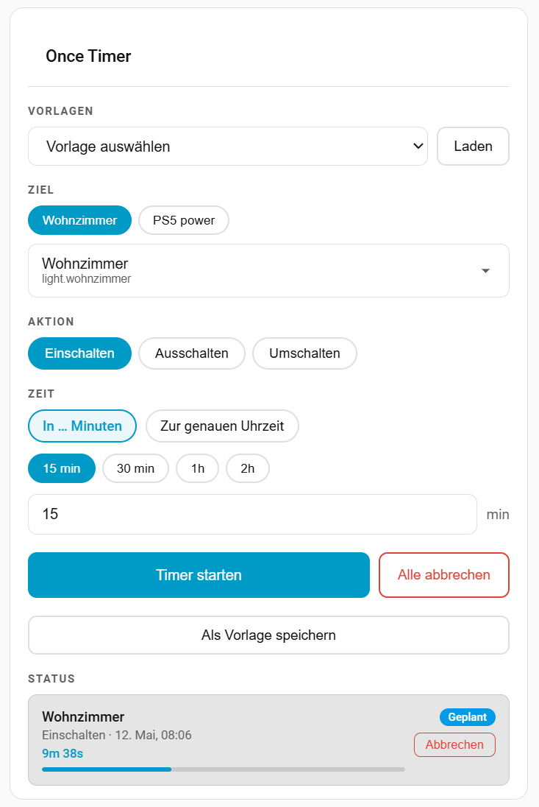
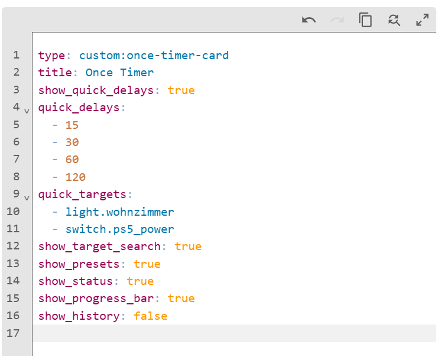

# Once Timer Card

A Lovelace card for the [Once Timer](https://github.com/NicoKortemeyer/Once_Timer) Home Assistant integration.

Schedule a one-shot action on any entity — directly from your dashboard.



[](https://github.com/hacs/integration)
[](https://github.com/NicoKortemeyer/once-timer-card/releases)

---

## Features

- **Entity search** with friendly names
- **Quick targets** — one-click favourite entity buttons
- **All available actions** per entity type (turn on/off, toggle, play, open, lock, …)
- **Delay or exact time** scheduling
- **Quick delay buttons** — one-click shortcuts (e.g. 15 min, 30 min, 1h)
- **Presets** — save and reload favourite configurations
- **Active timer overview** with countdown, progress bar and cancel button
- **Timer history** with restart button
- **German & English** — automatically matches your HA language setting
- **Fully configurable** via the Lovelace UI editor

---

## Requirements

The **Once Timer integration** must be installed first:
→ [Once Timer Integration](https://github.com/NicoKortemeyer/Once_Timer)

---

## Installation

### Via HACS (Custom Repository)

1. Open HACS in Home Assistant
2. Go to **Frontend** → ⋮ → **Custom Repositories**
3. Add `https://github.com/NicoKortemeyer/once-timer-card` with category **Lovelace**
4. Search for **Once Timer Card** and install it
5. Clear browser cache (Ctrl+Shift+R)

---

## Usage

Add the card via the Lovelace UI editor, or manually:

```yaml
type: custom:once-timer-card
title: Once Timer
```

---

## Configuration

All options can be set via the visual card editor. Here is the full reference:



### General

| Option | Type | Default | Description |
|--------|------|---------|-------------|
| `title` | string | *(none)* | Card title shown in the header |

### Target

| Option | Type | Default | Description |
|--------|------|---------|-------------|
| `default_entity_id` | string | *(none)* | Pre-selects this entity when the card loads |
| `lock_target` | boolean | `false` | Hide the target section — entity is fixed to `default_entity_id` |
| `show_target_search` | boolean | `true` | Show the entity search dropdown |
| `quick_targets` | list | `[]` | Entity IDs shown as one-click chips above the search |

### Time

| Option | Type | Default | Description |
|--------|------|---------|-------------|
| `show_quick_delays` | boolean | `true` | Show quick delay buttons (one-click shortcuts) |
| `quick_delays` | list | `[15, 30, 60, 120]` | Delay values in minutes for the quick buttons |
| `show_time_input` | boolean | `true` | Show the mode toggle and time/delay input field |

### Actions

| Option | Type | Default | Description |
|--------|------|---------|-------------|
| `show_presets` | boolean | `true` | Show the presets section (load/save/delete) |
| `show_cancel_all` | boolean | `true` | Show "Cancel all" button when timers are active |

### Status

| Option | Type | Default | Description |
|--------|------|---------|-------------|
| `show_progress_bar` | boolean | `true` | Show a progress bar on active timers |
| `show_status` | boolean | `true` | Show the active timers list — when hidden, a badge in the title shows the count |
| `show_history` | boolean | `false` | Show the timer history section |

### Advanced

| Option | Type | Default | Description |
|--------|------|---------|-------------|
| `allowed_domains` | list | see below | Restrict which entity domains appear in the search |

**Default domains:** `light`, `switch`, `fan`, `media_player`, `climate`, `cover`, `lock`, `vacuum`, `input_boolean`, `automation`, `script`, `alarm_control_panel`

---

## Examples

### Minimal card

```yaml
type: custom:once-timer-card
title: Once Timer
```

### Bedroom light — fixed target, quick delays only

```yaml
type: custom:once-timer-card
title: Schlafzimmer Licht
default_entity_id: light.schlafzimmer
lock_target: true
show_target_search: false
show_time_input: false
show_quick_delays: true
quick_delays:
  - 15
  - 30
  - 60
show_presets: false
show_status: true
```

### Dashboard with favourite entities

```yaml
type: custom:once-timer-card
title: Timer
quick_targets:
  - light.wohnzimmer
  - switch.tv
  - light.schlafzimmer
show_target_search: false
show_quick_delays: true
quick_delays:
  - 15
  - 30
  - 60
  - 120
```

---

## License

MIT © Nico Kortemeyer
